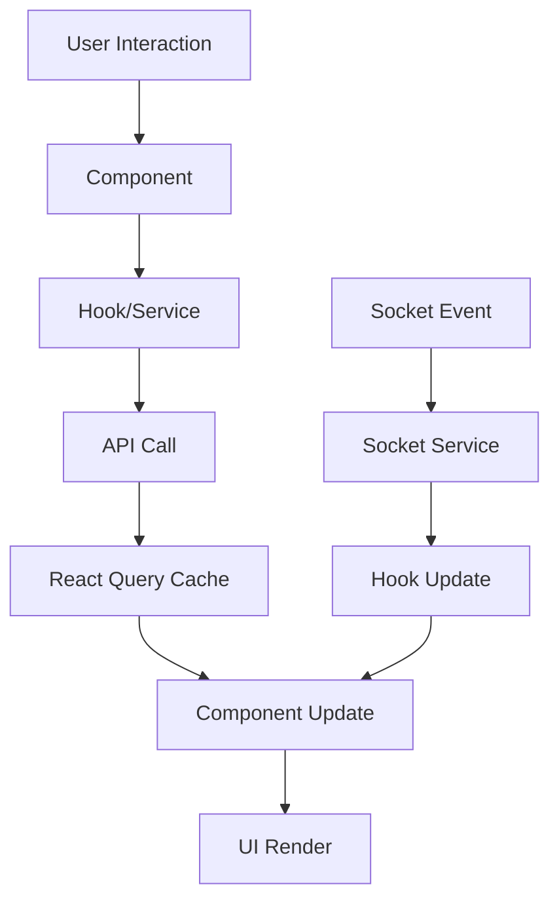

# 🏗️ Architecture Frontend Gabon Trade Hub

## 📊 Vue d'ensemble de l'Architecture

```
src/
├── 📁 components/        # Composants réutilisables
│   ├── auth/            # Authentification
│   ├── categories/      # Gestion des catégories
│   ├── chat/            # Chat direct
│   ├── home/            # Page d'accueil
│   ├── layout/          # Layout et navigation
│   ├── messaging/       # Système de messagerie
│   ├── notifications/   # Notifications
│   ├── product/         # Produits
│   ├── supplier/        # Fournisseurs
│   └── ui/              # Composants UI de base
├── 📁 hooks/            # Hooks personnalisés
│   └── api/             # Hooks pour les API
├── 📁 pages/            # Pages de l'application
├── 📁 services/         # Services et API
├── 📁 types/            # Types TypeScript
├── 📁 utils/            # Utilitaires
└── 📁 config/           # Configuration
```

## 🔧 Stack Technique Détaillée

### Core Framework
- **React 18.3.1** - Framework UI avec Concurrent Features
- **TypeScript 5.5.3** - Typage statique strict
- **Vite 5.4.1** - Build tool moderne et rapide

### UI & Styling
- **Shadcn/ui** - Composants accessibles et customisables
- **Radix UI** - Primitives UI headless
- **Tailwind CSS 3.4.11** - CSS utilitaire
- **Lucide React** - Icônes modernes
- **Tailwind Animate** - Animations CSS

### État & Data Management
- **React Query (@tanstack/react-query 5.56.2)** - Cache et synchronisation
- **React Hook Form 7.53.0** - Gestion des formulaires
- **Zod 3.23.8** - Validation des schémas
- **Context API** - État global léger

### Communication
- **Axios 1.11.0** - Client HTTP
- **Socket.IO Client 4.8.1** - WebSocket temps réel
- **React Router DOM 6.26.2** - Routing SPA

### Utilitaires
- **date-fns 3.6.0** - Manipulation des dates
- **clsx + tailwind-merge** - Gestion des classes CSS
- **class-variance-authority** - Variants de composants

## 🏛️ Architecture en Couches

### 1. Couche de Présentation (Pages)
```typescript
// Structure des pages
pages/
├── Index.tsx              # Page d'accueil
├── Login.tsx              # Connexion
├── Register.tsx           # Inscription
├── Dashboard.tsx          # Tableau de bord
├── Products.tsx           # Catalogue
├── ProductDetail.tsx      # Détail produit
├── Messages.tsx           # Messagerie
└── ...
```

### 2. Couche Composants
```typescript
// Hiérarchie des composants
components/
├── layout/               # Layout global
│   ├── Header.tsx
│   ├── Footer.tsx
│   └── Layout.tsx
├── ui/                   # Composants de base
│   ├── button.tsx
│   ├── input.tsx
│   └── ...
└── feature/              # Composants métier
    ├── auth/
    ├── product/
    └── messaging/
```

### 3. Couche Services
```typescript
// Services API
services/
├── api.ts               # Client API principal
├── authService.ts       # Authentification
├── productService.ts    # Produits
├── messageService.ts    # Messagerie
└── socketService.ts     # Socket.IO
```

### 4. Couche Hooks
```typescript
// Hooks personnalisés
hooks/
├── api/                 # Hooks API
│   ├── useAuth.ts
│   ├── useProducts.ts
│   └── useMessages.ts
├── useSocket.ts         # Socket.IO
└── useForm.ts           # Formulaires
```

## 🔄 Flux de Données



## 🛡️ Sécurité Frontend

### Authentification
```typescript
// JWT Token Management
const useAuth = () => {
  const [token, setToken] = useState(localStorage.getItem('token'));
  
  const login = async (credentials) => {
    const response = await authService.login(credentials);
    setToken(response.token);
    localStorage.setItem('token', response.token);
  };
  
  const logout = () => {
    setToken(null);
    localStorage.removeItem('token');
  };
};
```

### Routes Protégées
```typescript
// Protection des routes
const ProtectedRoute = ({ children, requiredRole }) => {
  const { user, isAuthenticated } = useAuth();
  
  if (!isAuthenticated) {
    return <Navigate to="/login" />;
  }
  
  if (requiredRole && user.role_id !== requiredRole) {
    return <Navigate to="/unauthorized" />;
  }
  
  return children;
};
```

### Validation des Données
```typescript
// Schémas Zod
const productSchema = z.object({
  nom: z.string().min(1, "Nom requis"),
  prix_unitaire: z.number().positive("Prix invalide"),
  description: z.string().min(10, "Description trop courte")
});
```

## 📡 Communication Temps Réel

### Socket.IO Integration
```typescript
// Service Socket.IO
class SocketService {
  private socket: Socket | null = null;
  
  connect(token: string) {
    this.socket = io(API_BASE_URL, {
      auth: { token }
    });
    
    this.socket.on('connect', () => {
      console.log('Connected to server');
    });
  }
  
  joinRoom(roomId: string) {
    this.socket?.emit('join_room', roomId);
  }
  
  sendMessage(message: Message) {
    this.socket?.emit('send_message', message);
  }
}
```

### Hook Socket Personnalisé
```typescript
// Hook useSocket
const useSocket = () => {
  const { token } = useAuth();
  const [isConnected, setIsConnected] = useState(false);
  
  useEffect(() => {
    if (token) {
      socketService.connect(token);
      setIsConnected(true);
    }
    
    return () => {
      socketService.disconnect();
      setIsConnected(false);
    };
  }, [token]);
  
  return { isConnected, socketService };
};
```

## 🎨 Système de Design

### Composants UI Shadcn
```typescript
// Exemple de composant Button
const Button = React.forwardRef<
  HTMLButtonElement,
  ButtonProps
>(({ className, variant, size, ...props }, ref) => {
  return (
    <button
      className={cn(buttonVariants({ variant, size, className }))}
      ref={ref}
      {...props}
    />
  );
});
```

### Variants avec CVA
```typescript
// Class Variance Authority
const buttonVariants = cva(
  "inline-flex items-center justify-center rounded-md text-sm font-medium",
  {
    variants: {
      variant: {
        default: "bg-primary text-primary-foreground hover:bg-primary/90",
        destructive: "bg-destructive text-destructive-foreground",
        outline: "border border-input hover:bg-accent"
      },
      size: {
        default: "h-10 px-4 py-2",
        sm: "h-9 rounded-md px-3",
        lg: "h-11 rounded-md px-8"
      }
    }
  }
);
```

## 🔧 Gestion d'État

### React Query Configuration
```typescript
// Configuration React Query
const queryClient = new QueryClient({
  defaultOptions: {
    queries: {
      staleTime: 5 * 60 * 1000, // 5 minutes
      cacheTime: 10 * 60 * 1000, // 10 minutes
      retry: 3,
      refetchOnWindowFocus: false
    }
  }
});
```

### Hooks API Personnalisés
```typescript
// Hook useProducts
const useProducts = (filters?: ProductFilters) => {
  return useQuery({
    queryKey: ['products', filters],
    queryFn: () => productService.getProducts(filters),
    enabled: !!filters
  });
};

// Hook avec mutation
const useCreateProduct = () => {
  const queryClient = useQueryClient();
  
  return useMutation({
    mutationFn: productService.createProduct,
    onSuccess: () => {
      queryClient.invalidateQueries(['products']);
    }
  });
};
```

## 📱 Responsive Design

### Breakpoints Tailwind
```typescript
// Configuration responsive
const breakpoints = {
  sm: '640px',   // Mobile large
  md: '768px',   // Tablette
  lg: '1024px',  // Desktop
  xl: '1280px',  // Desktop large
  '2xl': '1536px' // Desktop XL
};
```

### Composants Adaptatifs
```typescript
// Exemple de composant responsive
const ProductGrid = () => {
  return (
    <div className="grid grid-cols-1 sm:grid-cols-2 lg:grid-cols-3 xl:grid-cols-4 gap-4">
      {products.map(product => (
        <ProductCard key={product.id} product={product} />
      ))}
    </div>
  );
};
```

## 🚀 Performance & Optimisations

### Code Splitting
```typescript
// Lazy loading des pages
const Dashboard = lazy(() => import('./pages/Dashboard'));
const Products = lazy(() => import('./pages/Products'));

// Utilisation avec Suspense
<Suspense fallback={<LoadingSpinner />}>
  <Routes>
    <Route path="/dashboard" element={<Dashboard />} />
    <Route path="/products" element={<Products />} />
  </Routes>
</Suspense>
```

### Memoization
```typescript
// React.memo pour les composants
const ProductCard = React.memo(({ product }) => {
  return (
    <div className="border rounded-lg p-4">
      <h3>{product.nom}</h3>
      <p>{product.prix_unitaire}€</p>
    </div>
  );
});

// useMemo pour les calculs coûteux
const expensiveValue = useMemo(() => {
  return products.reduce((sum, p) => sum + p.prix_unitaire, 0);
}, [products]);
```

### Debouncing
```typescript
// Hook useDebounce
const useDebounce = (value: string, delay: number) => {
  const [debouncedValue, setDebouncedValue] = useState(value);
  
  useEffect(() => {
    const handler = setTimeout(() => {
      setDebouncedValue(value);
    }, delay);
    
    return () => clearTimeout(handler);
  }, [value, delay]);
  
  return debouncedValue;
};
```

## 🧪 Qualité du Code

### TypeScript Strict Mode
```typescript
// Configuration TypeScript stricte
{
  "compilerOptions": {
    "strict": true,
    "noImplicitAny": true,
    "noImplicitReturns": true,
    "noUnusedLocals": true,
    "noUnusedParameters": true
  }
}
```

### Types Personnalisés
```typescript
// Types métier
interface User {
  id: number;
  email: string;
  nom: string;
  prenom?: string;
  role_id: 1 | 2 | 3;
  entreprise?: Entreprise;
}

interface Product {
  id: number;
  nom: string;
  prix_unitaire: number;
  stock_disponible: number;
  images: ProductImage[];
}
```

## 🔧 Configuration Build

### Vite Configuration
```typescript
// vite.config.ts
export default defineConfig({
  plugins: [react(), componentTagger()],
  resolve: {
    alias: {
      "@": path.resolve(__dirname, "./src")
    }
  },
  build: {
    rollupOptions: {
      output: {
        manualChunks: {
          vendor: ['react', 'react-dom'],
          ui: ['@radix-ui/react-dialog', '@radix-ui/react-dropdown-menu']
        }
      }
    }
  }
});
```

## 📦 Structure des Modules

### Barrel Exports
```typescript
// components/index.ts
export { Button } from './ui/button';
export { Input } from './ui/input';
export { ProductCard } from './product/ProductCard';
export { Header } from './layout/Header';
```

### Services Modulaires
```typescript
// services/index.ts
export { default as api } from './api';
export { default as authService } from './authService';
export { default as productService } from './productService';
export { default as socketService } from './socketService';
```

---

*Architecture conçue pour la maintenabilité, la performance et l'expérience utilisateur*